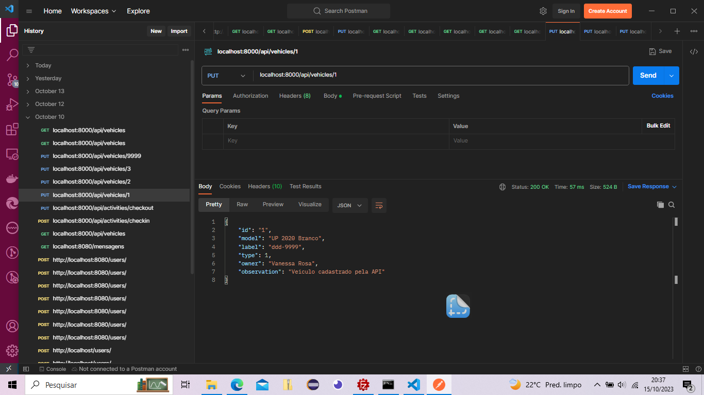

# Sobre Projeto:

Sistema de gerenciamento estacionamento veículos:
Este sistema fornece operações essenciais para o gerenciamento
eficaz de veículos em um estacionamento.
Operações disponiveis:
Verificar cadastro (Get): endepoint : '/api/vehicles/{id}'
Verificar listar veículos (Get): endepoint : '/api/vehicles'
Cadastrar novo veículo (Post): endepoint : '/api/vehicles'
Atualizar cadastro veículo (Put): endepoint : '/api/vehicles/{id}'
Exclusão de um veículo (Delete): endepoint : '/api/vehicles/{id}'

[Projeto disponível](https://projetocss-jesscoder.netlify.app/)

### Linguagens e Ferramentas

- HTML
- CSS
- Javascript
- Nodejs
- Vscode
- Live Server

## Print da tela

### Contribua com o projeto

- Realize o Fork
- Faça as modificações necessárias
- Realize a Pull Request (PR)

### Fucionalidades das atividades

- [x] activityCheckin
- [x] activityCheckout
- [x] activityList
- [x] activityRemove

### Relacionadas ao cadastros

- [x] listVehicles
- [x] insertVehicles
- [x] updateVehicles
- [x] removeVehicle

* id
* model
* label
* type
* owner
* observation

### Autor

<a> Eduardo Rodrigues</a> 
<a> https://github.com/EduarddoRodrigues2801</a>
